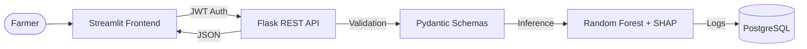

# 🌾 Smart Crop Recommendation System 2.0

[](https://opensource.org/licenses/MIT)
[](https://www.python.org/)
[](https://flask.palletsprojects.com/)
[](https://streamlit.io/)

An enterprise-grade **Decision Support System (DSS)** powered by Machine Learning to help farmers optimize crop selection based on soil chemistry and climate data.

> [!NOTE]
> For a deep dive into the system architecture, security implementation, and ML pipeline, refer to the **[Comprehensive Technical Manual](DOCUMENTATION.md)**.

---

## 🌟 Key Technical Differentiators

Unlike basic ML prototypes, this system is built for production reliability:

- **🛡️ Multi-Tier Security**: Stateless **JWT Authentication** (Access/Refresh strategy) with **Bcrypt** password hashing.
- **🔍 Explainable AI (XAI)**: Integrated **SHAP** engine to provide top-3 scientific reasons for every prediction.
- **🧬 Domain Engineering**: Custom agricultural features including **Growing Degree Days (GDD)** and **Temperature-Humidity Index (THI)**.
- **⚖️ Scientific Rigor**: Automated **Model Comparison Pipeline** (RF, XGBoost, SVM) with 5-fold cross-validation reports.
- **🌐 Localization**: Full UI support for **English, Hindi, and Marathi**.
- **🏥 System Health**: Versioned `/api/v1/` endpoints with real-time `/health` heartbeat monitoring.

---

## 🏗️ System Architecture



---

## 🚀 Installation & Setup

### Backend (Flask)
```bash
cd crop-recommendation-backend
python -m venv venv
# Windows: venv\Scripts\activate | Mac/Linux: source venv/bin/activate
pip install -r requirements.txt
python app.py
```

### Frontend (Streamlit)
```bash
cd crop-recommendation-frontend
python -m venv venv
# Windows: venv\Scripts\activate | Mac/Linux: source venv/bin/activate
pip install -r requirements.txt
streamlit run app.py
```

---

## 🛠️ Tech Stack

| Layer | Technologies |
| :--- | :--- |
| **Backend** | Flask, SQLAlchemy, Pydantic, PyJWT, Bcrypt |
| **Frontend** | Streamlit, Plotly, Multi-language Support |
| **ML Engine** | Scikit-Learn, XGBoost, SHAP |
| **Infrastructure** | Render (Blueprints), GitHub Actions, Gunicorn |

---

## ☁️ One-Click Deployment

This project includes a `render.yaml` blueprint for automated orchestration on **Render**:

1. Fork this repository.
2. Connect to [Render](https://render.com).
3. Select **New > Blueprint**.
4. The system will automatically provision both Backend (Flask) and Frontend (Streamlit) services with cross-linked environment variables.

---

## 📄 License
This project is licensed under the MIT License - see the [LICENSE](LICENSE) file for details.

*Built with ❤️ for Sustainable Agriculture.*
